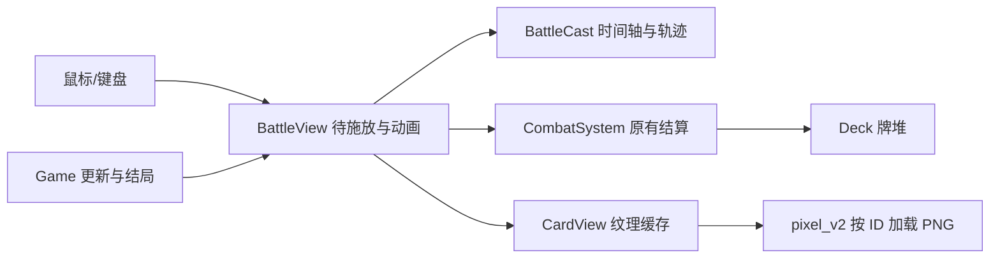

# 战斗动画与负面牌牌面上下文

生成时间：2026-09-11（香港时间）

## 需求、范围与验收

重写手牌施放与命中反馈，参考《杀戮尖塔》的短促出牌节奏，补齐所有实际存在的负面牌素材。交付源码、PNG 素材、本地测试与审查报告。不得改变卡牌数值与规则，不引入新的渲染或构建框架。

## 既有实现分析

1. `src/ui/BattleView.cpp:325`：点击立即调用 playCard，动画随后飞向目标，导致数值与反馈错位。复用目标选择、悬停纹理缓存、角色纹理和音效。
2. `src/ui/BattleCast.cpp:23`：目标解析和无状态插值，可承载可独立测试的分阶段轨迹；持续能力包含敌方效果，不应因此要求选择敌人。
3. `src/ui/BattleHover.cpp:17`：手牌布局和从末尾命中测试；点击应与悬停采用相同的最上层牌规则。
4. `src/ui/CardView.cpp:46`：按 ID 延迟加载 `assets/images/cards/pixel_v2/<id>.png`，负面牌缺图时绘制几何底板。新增同名素材即可覆盖战斗、悬停与牌堆。
5. `src/combat/CombatSystem.cpp:187`：出牌前检查费用，先移动牌堆再结算效果；应复用其消耗判定，不能以结算后牌堆数量推测去向。
6. `tests/battle_cast_tests.cpp`、`tests/battle_hover_tests.cpp`：C++ require 异常断言，CMake/CTest 自动执行，具备 SFML 渲染环境。

## 依赖与集成

C++17、SFML 3.0.1、本地 VS2022、既有 CMake windows-x64/release 预设；四空格、花括号独立行、英文标识符、中文说明、UTF-8 无 BOM。SFML 的 Sprite::setColor、RenderTexture 与现有 UiHelpers 负责淡出和绘制，不新增依赖。

## 计划与 TODO

- [x] 检索实现、测试、素材和依赖。
- [x] 分离短促起手、命中结算和退场；普通牌入弃牌堆，消耗牌燃散，能力牌升起消散。
- [x] 添加攻击斩击、防御护盾、能力光芒、减益反馈、数字与短促后坐；修复选牌目标和结束动画时序。
- [x] 自动验证时间轴边界、错误恢复、连续出牌、牌堆去向和渲染。
- [x] 接入用户提供的伤口、眩晕、灼伤、黏液、黑暗侵蚀五张像素风牌面，核对中文及运行时加载。
- [x] 本地完整构建、CTest、图像检查和审查评分。

## 充分性检查与风险

上述六处实现明确了接口、复用和风格。动画只在 0.10 秒起手期间持有唯一待结算索引，禁止此阶段修改手牌；结算后可继续出牌，退场可重叠。失败出牌必须清理动画锁且不重复扣费。低帧率跨越命中点必须恰好结算一次。胜利/复活转换应等待最后反馈。

负面牌定义集中在 CombatSystem.cpp:38，共五张，未发现实际定义的 Curse 牌。现有 PNG 为完整像素卡框、插画、中文标题与描述。生成应参照现有卡框，不捏造未实现的诅咒牌。

## 工具缺失与补偿

sequential-thinking、shrimp-task-manager、desktop-commander、context7、github.search_code 均未提供。按“分析→计划→执行”顺序在本文和 operations-log.md 留痕；使用 PowerShell/rg、本地 SFML 头文件文档及既有实现代替，未执行远程流水线。imagegen 内置工具缺失，用户曾授权备用 CLI，随后改为自行提供五张牌面；未调用 API。图片已接入并通过运行时纹理校验。

